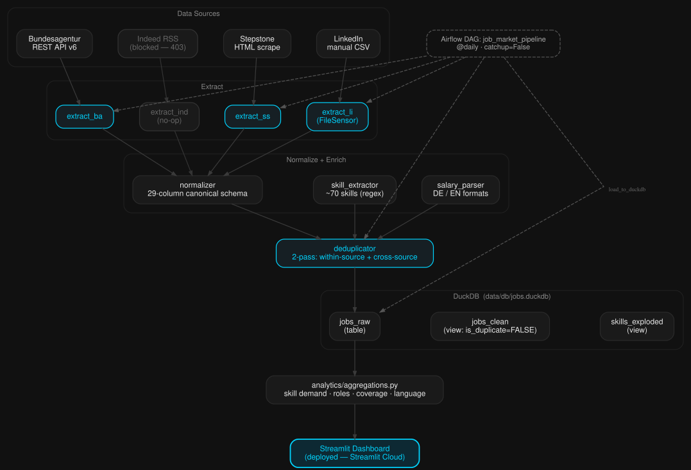

# German Job Market Analytics

A multi-source ETL pipeline that collects data engineering and analytics job
postings from German job boards, normalises them into a common schema,
deduplicates across sources, and surfaces skill-demand trends through a
Streamlit dashboard.

**Live dashboard:** https://german-job-market-analytics.streamlit.app

---

## What this does and why

Publicly available data on which tools German employers require is scattered
across several job boards with different formats, languages, and update
cadences. This project pulls three active sources into a single DuckDB store so
that questions like "Is Spark demand falling relative to dbt?" or "Do Berlin
roles pay more than Munich for the same title?" can be answered from one place
rather than four manual searches.

---

## Screenshots

<!-- Add screenshots here once the live dashboard is running -->
<!-- Suggested: skill frequency bar chart, role distribution pie, salary box plot -->

---

## Architecture


Indeed RSS          ✗  blocked (HTTP 403) — extractor retained, no live data
```

**Extract** — each source has its own extractor in `etl/extractors/`. Every run
saves an immutable dated snapshot under `data/raw/{source}/YYYY-MM-DD/` before
any transformation. Extractors return `[]` on failure; they never raise.

**Normalise** — `etl/transformers/normalizer.py` maps source-specific field
names to a canonical 29-column schema (see `docs/schema.md`). It detects
description language via `langdetect`, assigns a role category from a keyword
taxonomy, and sets `employment_type` / `work_model` via regex scans.

**Enrich** — two transformer modules run after normalisation:
- `salary_parser.py` — extracts salary ranges from free text in German and
  English formats; converts monthly figures to annual.
- `skill_extractor.py` — regex word-boundary scan against ~70 canonical tech
  skills; aliases (e.g. `GCP` → `Google Cloud Platform`) collapse to a
  canonical name stored in a `VARCHAR[]` array.

**Deduplicate** — `deduplicator.py` runs two passes:
1. Within each source, repeated `job_id` values are marked.
2. Across sources, records matching on city + fuzzy company (≥ 85) + fuzzy
   title (≥ 85) + posted date (within 7 days) are collapsed; the
   higher-priority source record becomes canonical (BA > Indeed > Stepstone
   > LinkedIn).

**Load** — `duckdb_loader.py` upserts into `jobs_raw` via DELETE + INSERT
(required for `VARCHAR[]` columns in DuckDB 1.1.3). Two derived views are
maintained automatically: `jobs_clean` (non-duplicate records) and
`skills_exploded` (one row per skill per job).

**Aggregate + Dashboard** — `analytics/aggregations.py` provides five SQL query
functions consumed by the Streamlit app in `dashboard/app.py`.

---

## Data sources

| Source | Method | ID prefix | Request gap |
|---|---|---|---|
| Bundesagentur für Arbeit | REST API v6 (official public endpoint) | `BA_` | 2 s |
| Stepstone | HTML scraping (requests + BeautifulSoup4) | `SS_` | 10–18 s random |
| LinkedIn | Manual CSV export | `LI_` | n/a |
| Indeed Germany | RSS feed — **blocked (HTTP 403); no live data** | `IN_` | 3 s |

> **Indeed status:** All `de.indeed.com/rss` endpoints return HTTP 403 on every
> live run. The extractor code and fixture-based tests are retained but Indeed
> is not an active data source. See `docs/decisions.md` for the full rationale.

Keywords tracked: `Data Engineer`, `Data Analyst`, `Data Scientist`,
`Analytics Engineer`, `BI Engineer`, `Machine Learning Engineer`

Geographic scope: Berlin (Stepstone and LinkedIn), all major German cities via
Bundesagentur.

---

## Tech stack

| Component | Library / tool | Version |
|---|---|---|
| Language | Python | 3.11 |
| HTTP requests | requests | 2.32.3 |
| RSS parsing | feedparser | 6.0.11 |
| HTML parsing | BeautifulSoup4 | 4.12.3 |
| Language detection | langdetect | 1.0.9 |
| Fuzzy matching | thefuzz | 0.22.1 |
| Analytical store | DuckDB | 1.1.3 |
| DataFrame layer | pandas | 2.2.2 |
| Orchestration | Apache Airflow | 2.9.3 |
| Dashboard | Streamlit | 1.36.0 |
| Charts | Plotly + Altair | 5.22.0 / 5.3.0 |
| Testing | pytest | 8.2.2 |
| Linting | black + ruff | 24.4.2 / 0.4.10 |

---

## Project structure

```
etl/
  extractors/
    bundesagentur.py   # BA API v6 — paginated fetch, dated JSON snapshot
    indeed.py          # RSS feed parser — dated CSV snapshot (blocked)
    stepstone.py       # HTML scraper — slug conversion, 403/429 guard
    linkedin.py        # manual CSV reader — relative date parsing, city auto-fill
  transformers/
    normalizer.py      # canonical schema mapping, language detection, role taxonomy
    skill_extractor.py # ~70-skill regex dictionary, alias collapsing
    salary_parser.py   # German/English salary ranges, monthly → annual conversion
    deduplicator.py    # two-pass: within-source job_id + cross-source fuzzy match
  loaders/
    duckdb_loader.py   # DELETE + INSERT upsert, jobs_raw table, views

analytics/
  aggregations.py      # five SQL aggregation functions for the dashboard

airflow/dags/
  job_market_pipeline.py  # daily DAG — extract, normalise, deduplicate, load

dashboard/
  app.py               # Streamlit app — four chart pages, sidebar filters
  charts.py            # Plotly / Altair chart builders

tests/
  extractors/          test_bundesagentur.py  test_indeed.py
                       test_stepstone.py      test_linkedin.py
  transformers/        test_normalizer.py     test_skill_extractor.py
                       test_salary_parser.py  test_deduplicator.py
  loaders/             test_duckdb_loader.py
  test_pipeline_e2e.py
  test_pipeline_integration.py   # 4-source fixture: normalise → dedup → load

docs/
  architecture.md     schema.md     decisions.md     progress.md

data/                 # gitignored — create locally before first run
  raw/                # immutable dated snapshots per source
  processed/          # optional debug intermediates
  db/                 # jobs.duckdb
```

---

## Local setup

**Prerequisites:** Python 3.11, git.

```bash
# 1. Clone and enter the repo
git clone https://github.com/adhishnanda/gjma.git
cd gjma

# 2. Create and activate the virtual environment
python3.11 -m venv .venv
# macOS / Linux:
source .venv/bin/activate
# Windows:
.venv\Scripts\activate

# 3. Install dependencies
pip install -r requirements.txt

# 4. Create the data directories (gitignored, not included in the repo)
mkdir -p data/raw data/processed data/db
```

**Run the pipeline manually:**

```bash
python -m etl.extractors.bundesagentur
python -m etl.extractors.stepstone
# LinkedIn: place your CSV export in data/raw/linkedin/YYYY-MM-DD/ first
# Indeed: extractor present but returns [] — RSS endpoint blocked (HTTP 403)
python -m etl.loaders.duckdb_loader
```

**Format and lint:**

```bash
black . && ruff check .
```

**Start Airflow:**

```bash
airflow standalone
```

**Run the dashboard:**

```bash
streamlit run dashboard/app.py
```

---

## Running tests

```bash
pytest tests/ -v
```

The suite runs entirely offline — all HTTP calls are mocked. No live credentials
or network access required. 312 tests pass, 3 skipped.

---

## Known limitations

**Skill coverage is low (~3.5%).** The skill dictionary contains ~70 entries
matched by regex. Many job descriptions use vendor-specific terminology,
abbreviations, or phrasing variants that the dictionary does not cover. Coverage
improves as the dictionary grows.

**Salary data is sparse.** The majority of German job postings do not state
salary ranges. Parsed figures come from the subset that do, so salary
distributions reflect a self-selected minority of listings and should not be
treated as market-wide estimates.

**LinkedIn data is manually collected.** LinkedIn does not offer a public API or
RSS feed. Data comes from LinkedIn's own CSV export tool, which means the
LinkedIn slice of the dataset is only as fresh as the last manual export.

**The DuckDB snapshot is frozen until the pipeline re-runs.** The Streamlit
Cloud deployment uses a committed `jobs.duckdb` snapshot. It does not update
automatically. To refresh, run the pipeline locally, commit the new snapshot,
and redeploy.

**Geographic scope is limited.** Stepstone and LinkedIn data covers Berlin only.
Bundesagentur covers the major German cities queried by the keyword list.

**Sampling, not census.** The pipeline queries a fixed set of six job-title
keywords. It captures a representative but incomplete slice of the market.

---

## Data methodology

**Rate limiting is built in.** Every extractor enforces minimum gaps between
requests (2 s for BA, 3 s for Indeed, 10–18 s random for Stepstone) and stops
immediately on 403 or 429 responses. The pipeline is deliberately sequential —
no parallelism.

**Raw snapshots are immutable.** `title_raw` and `description_raw` are never
modified after extraction. All transformations operate on derived fields.

**Source characteristics differ.** The Bundesagentur endpoint is an official
public API. Stepstone data is scraped from public search pages. LinkedIn data is
collected via LinkedIn's own CSV export tool — no automated LinkedIn scraping.

**Not for commercial use.** All data collected is used solely for technical
analysis and demonstration purposes.

---

## Author

**Adhish Nanda**

- GitHub: [github.com/adhishnanda](https://github.com/adhishnanda)
- LinkedIn: [linkedin.com/in/adhishnanda](https://linkedin.com/in/adhishnanda)
- Email: adhish.nanda@gmail.com
